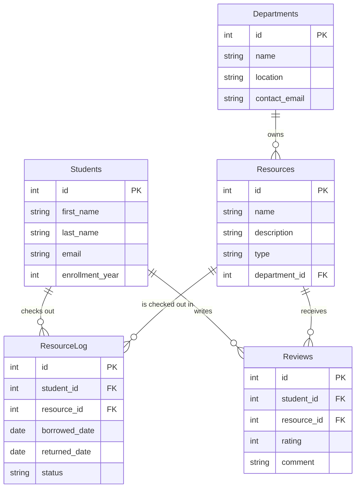

# Campus Resource Hub: SQL Workshop

Welcome to the SQL Database Workshop! In this repository, you will learn the basics of relational databases by building a SQLite database for a **Campus Resource Hub**.

## Scenario
You have been tasked with building the backend database schema to manage campus resources (hardware, rooms, software licenses) that students can check out from different campus departments.

##  Database Schema

The database will contain 5 tables. Here is how they relate to each other:



---

##  Step 1: Getting Started

You will be using `sqlite3` at the command line.

**Mac/Linux:** Usually pre-installed. Open your terminal.
**Windows:** If you don't have SQLite, you can download the command-line tools from the [SQLite Website](https://www.sqlite.org/download.html). Or, you can use online interactive tools like [DB Fiddle](https://www.db-fiddle.com/).

To open a new SQLite database called `campus_hub.db`, type this in your terminal inside this repository folder:
```bash
sqlite3 campus_hub.db
```
You will notice the prompt changes to `sqlite>`. This means you are now talking directly to the SQLite database engine!
- Type `.help` for a list of SQLite commands.
- Type `.quit` (or `.q`) to exit back to the normal terminal.

---

## 🏗️ Step 2: Creating the Tables

The file `create_tables.sql` contains all the `CREATE TABLE` commands. Take a moment to read that file to see how tables, columns, data types (TEXT, INTEGER, DATE), and Primary/Foreign Keys are defined.

To execute this file and build the schema, run this **inside the `sqlite>` prompt**:
```sql
.read create_tables.sql
```

Check that the tables actually exist by typing:
```sql
.tables
```
To see the structure of a specific table, use:
```sql
.schema Students
```

---

##  Step 3: Seeding the Data

An empty database isn't much fun to query. Let's add some "dummy" data to practice with. We've written `INSERT` statements in `seed_data.sql`.

Execute them in the `sqlite>` prompt:
```sql
.read seed_data.sql
```

You can verify the data is there by running a `SELECT` statement directly in the prompt:
```sql
SELECT * FROM Students;
```

*(Tip: type `.mode box` followed by Enter before running your SELECT if you want your output to look like a nice table!)*

---

##  Step 4: Your Turn - The Exercises

Open `exercises.sql` in your code editor. This file contains step-by-step prompts for you to write your own `SELECT`, `ALTER`, `UPDATE`, `INSERT`, and `DELETE` queries.

You can copy and paste your answers from the file directly into the `sqlite>` prompt to test them!

Good luck, and have fun building the hub!