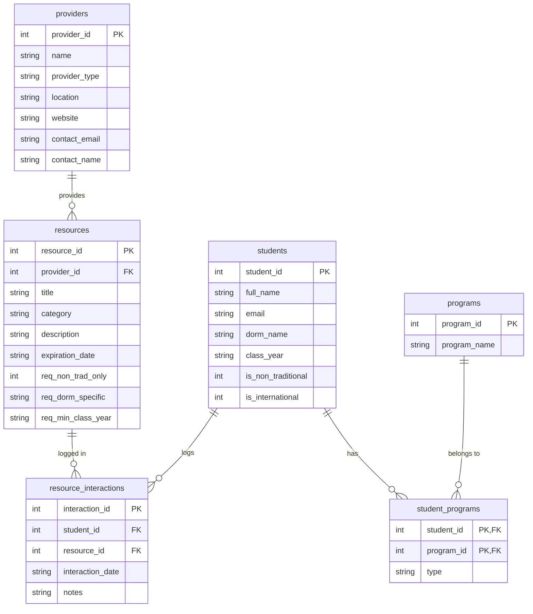

# Campus Resource Hub: SQL Workshop

Welcome to the SQL Database Workshop! In this repository, you will learn the basics of relational databases by building a SQLite database for a **Campus Resource Hub**.

## Scenario
You have been tasked with building the backend database schema to manage campus resources (like grants, advising, or special programs) provided by different groups (departments, centers, clubs). Resources may have eligibility requirements such as dorm residency, class year, or non-traditional student status. Students are linked to their academic programs (majors/minors) to further determine eligibility.

##  Database Schema

The database will contain 6 tables. Here is how they relate to each other:



---

##  Step 1: Getting Started

You will be using `sqlite3` at the command line.

**Mac/Linux:** Usually pre-installed. Open your terminal.
**Windows:** If you don't have SQLite, you can download the command-line tools from the [SQLite Website](https://www.sqlite.org/download.html). Or, you can use the command from the presentation.

To open a new SQLite database called `campus_resources.db`, type this in your terminal inside this repository folder:
```bash
sqlite3 campus_resources.db
```
You may need to delete the file if it already exists from the previous version.

You will notice the prompt changes to `sqlite>`. This means you are now talking directly to the SQLite database engine!
- Type `.help` for a list of SQLite commands.
- Type `.quit` (or `.q`) to exit back to the normal terminal.

---

##  Step 2: Creating the Tables

The file `create_tables.sql` contains all the `CREATE TABLE` commands. Take a moment to read that file to see how tables, columns, data types (TEXT, INTEGER, DATE), and Primary/Foreign Keys are defined.

To execute this file and build the schema, run this **inside the `sqlite>` prompt**:
```sql
.read create_tables.sql
```

Check that the tables actually exist by typing:
```sql
.tables
```
To see the structure of a specific table, use:
```sql
.schema students
```

---

##  Step 3: Seeding the Data

An empty database isn't much fun to query! Head over to the `seeding_guide/` directory and check out the `README.md` there. It will explain how to safely insert dummy data into your tables and how to properly respect Database Foreign Key requirements.

Once you have read the guide and reviewed the mock data, run this in your `sqlite>` prompt to automatically insert all records in order:
```sql
.read seeding_guide/seed_all.sql
```

You can verify the data is there by running a `SELECT` statement directly in the prompt:
```sql
SELECT * FROM students;
```

*(Tip: type `.mode box` followed by Enter before running your SELECT if you want your output to look like a nice table!)*

---

##  Step 4: Launch the Interactive UI Dashboard

If you want to see all your data come to life, we've included an Interactive Dashboard written in Python that allows you to click through Student Profiles, Admin Data, and Resource Interactions. 

Check out the [Dashboard Setup Guide (DASHBOARD_README.md)](DASHBOARD_README.md) to see how to instantly launch the UI on your laptop without the hassle of setting up a Python environment!

---

##  Step 5: Your Turn - The Exercises

Open `exercises.sql` in your code editor. This file contains step-by-step prompts for you to write your own `SELECT`, `ALTER`, `UPDATE`, `INSERT`, and `DELETE` queries based on the new schema.

You can copy and paste your answers from the file directly into the `sqlite>` prompt to test them!

Good luck, and have fun building the hub!
